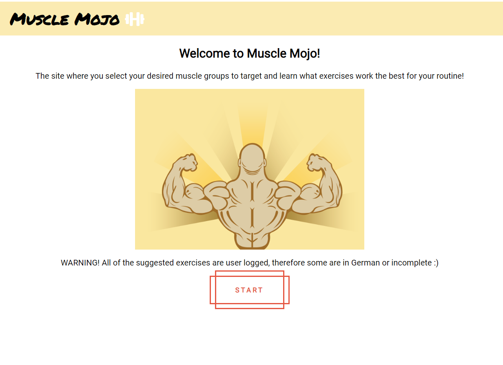
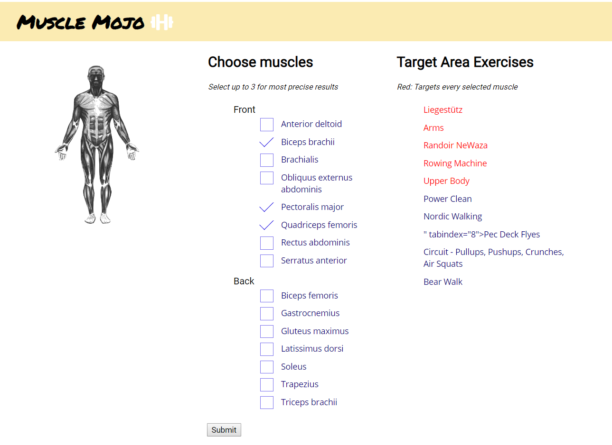
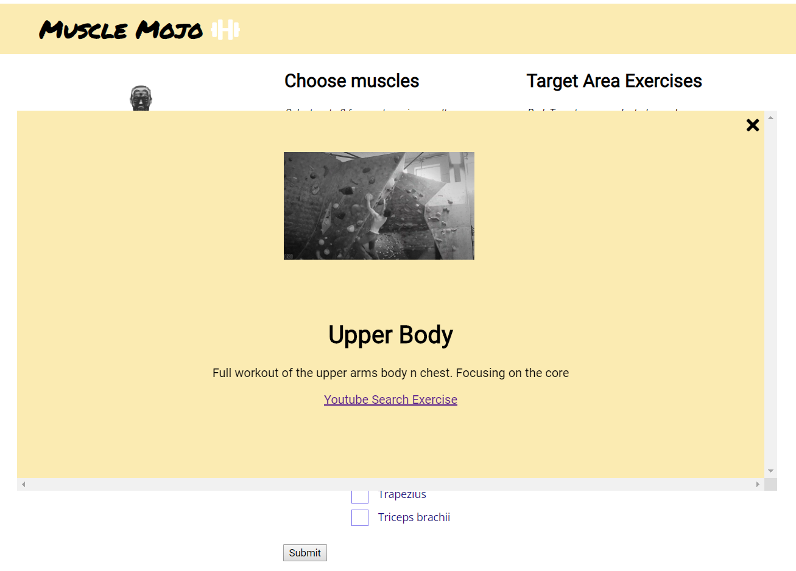

# musclemojo
Specific Muscle Targeting Exercises

User selects the muscle they want to find exercises for and with the use of the wger api 
results corresponding to their selections show with an animated gif from the giphy api

## Screenshots
Landing Page:

Main Content Page:

Exercise On-Click Pop Out

## Live Demo
https://thy-neighbor.github.io/musclemojo/

## Api Usage
https://wger.de/en/software/api
http://developers.giphy.com

## Technology Used

#### HTML
#### CSS
#### JavaScript
#### jQuery

